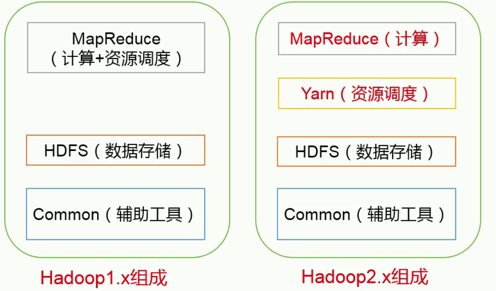
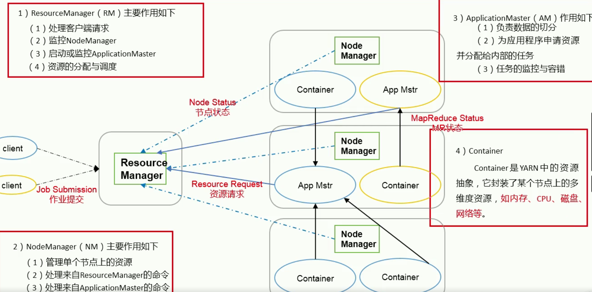
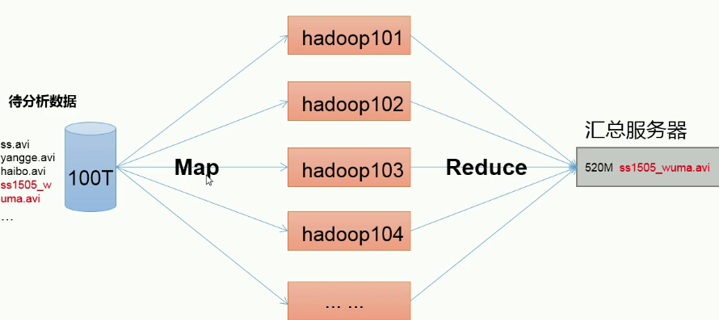

[TOC]


# 一、Hadoop2.x

## 1.1 Hadoop的优势

1. 高可靠性：Hadoop底层维护多个数据副本，所以即使Hadoop某个计算元素或存储出现故障，也不会导致数据的丢失。
2. 高扩展性：在集群间分配任务数据，可方便的扩展数以千计的节点。
3. 高效性：在MapReduce的思想下，Hadoop是并行工作的，以加快任务处理的速度。
4. 高容错性：能够自动将失败的任务重新分配。

## 1.2 Hadoop1.x和Hadoop2.x的区别

- 

## 1.3 Hadoop组成

### 1.3.1 HDFS

1. NameNode：存储文件的元数据，如文件名，文件目录结构，文件属性，以及每个文件的块列表和块所在的DataNode等。
2. DataNode：在本地文件系统存储文件块数据。
3. Secondary NameNode：监控HDFS状态的辅助后台程序。

### 1.3.2 YARN

- 

### 1.3.3 MapReduce

- 

# 二、Hadoop运行环境搭建

1. 配置JDK环境变量

2. 将hadoop解压到module文件夹

   ```sh
   tar -zxvf jdk-8u144-linux-x64.tar.gz  -C /opt/module/
   ```

3. 获取hadoop目录，配置环境变量

   ```sh
   pwd
   vim /etc/profile
   ```

4. 在文件末尾添加：

   ```sh
   ##HADOOP_HOME
   export HADOOP_HOME=/opt/module/hadoop-2.7.2
   export PATH=$PATH:$HADOOP_HOME/bin
   export PATH=$PATH:$HADOOP_HOME/sbin
   ```

5. 重新加载配置文件：

   ```sh
   source /etc/profile
   ```

# 三、Hadoop运行模式

## 3.1 本地模式

### 3.1.1 grep案例

1. 将hadoop中etc/hadoop目录中的xml文件拷贝到input目录下

   ```sh
   cp etc/hadoop/*.xml input/
   ```

2. ```sh
   hadoop jar share/hadoop/mapreduce/hadoop-mapreduce-examples-2.7.2.jar grep input/ output 'dfs[a-z.]+'
   ```

### 3.1.2 WordCount案例

1. 在hadoop目录下创建wcinput目录，在wcinput目录下创建wc.input文件，并写入测试数据

   ```sh
   mkdir wcinput
   ```

   ```sh
   touch wc.input
   ```

2. 统计单词个数

   ```sh
   hadoop jar share/hadoop/mapreduce/hadoop-mapreduce-examples-2.7.2.jar wordcount wcinput/ wcoutput
   ```

## 3.2 伪分布式运行模式

### 3.2.1 启动HDFS并运行MapReduce程序

(1) 配置集群

​	(a) 配置：hadoop-env.sh

​	LInux系统中获取JDK的安装路径：

```sh
echo $JAVA_HOME
```

​	修改JAVA_HOME路径：

```sh
export JAVA_HOME=/opt/module/jdk1.8.0_144
```
​	(b) 配置：core-site.xml

   ```xml
   <!-- 指定HDFS中NameNode的地址 -->
   <property>
   	<name>fs.defaultFS</name>
     	<value>hdfs://ip或主机名:9000</value>
   </property>
   <!-- 指定货hadoop运行时产生文件的存储目录 -->
   <property>
   	<name>hadoop.tmp.dir</name>
     	<value>/opt/module/hadoop-2.7.2/data/tmp</value>
   </property>
   ```

   

​	(c) 配置：hdfs-site.xml

   ```xml
   <!-- 指定HDFS副本的数量 -->
   <property>
   	<name>dfs.replication</name>
     	<value>1</value>
   </property>
   ```

(2) 启动集群

​	(a) 进入hadoop目录下

​	格式化NameNode（第一次启动时格式化，以后不要总格式化）

```sh
bin/hdfs namenode -format
```
​	(b) 启动NameNode

   ```sh
sbin/hadoop-daemon.sh start namenode
   ```

​	(c) 启动DataNode

   ```sh
sbin/hadoop-daemon.sh start datanode
   ```

(3) 查看集群

​	(a) 查看是否启动成功

```sh
[root@xpc hadoop-2.7.2]# jps 
1812 DataNode
2022 Jps
129848 NameNode
```

​	(b) web端查看HDFS文件系统

​	http://ip:50070

### 3.2.2 启动YARN并运行MapReduce程序

1. 分析

  ​（1）配置集群在YARN上运行MR

  ​（2）启动、测试集群增、删、查

  ​（3）在YARN上执行WordCount案例

2. 执行步骤

   （1）配置集群

   ​	（a）配置yarn-env.sh

   ​		配置一下JAVA_HOME

   ```sh
   # some Java parameters
   export JAVA_HOME=/opt/module/jdk1.8.0_144
   if [ "$JAVA_HOME" != "" ]; then
     #echo "run java in $JAVA_HOME"
     JAVA_HOME=$JAVA_HOME
   fi

   ```

   ​	（b）配置yarn-site.xml

   ```xml
   <!-- Reducer获取数据的方式 -->
   <property>
   	<name>yarn.nodemanager.aux-services</name>
     	<value>mapreduce_shuffle</value>
   </property>

   <!-- 指定YARN的ResourceManager的地址 -->
   <property>
   	<name>yarn.resourcemanager.hostname</name>
     	<value>xpc</value>
   </property>
   ```

   ​	（c）配置mapred-env.sh

   ​		配置一下JAVA_HOME

   ```sh
   export JAVA_HOME=/opt/module/jdk1.8.0_144
   ```

   ​	（d）配置：（对mapred-site.xml.template重新命名为）mapred-site.xml

   ```sh
   mv mapred-site.xml.template mapred-site.xml
   ```

   ```xml
   <!-- 指定MR运行在YARN上 -->
   <property>
   	<name>mapreduce.framework.name</name>
     	<value>yarn</value>
   </property>
   ```

   ​	（2）启动集群

   ​		（a）启动前必须保证NameNode和DataNode已经启动

   ​		（b）启动ResourceManager

   ```sh
   sbin/yarn-daemon.sh start resourcemanager
   ```

   ​		（c）启动NodeManager

   ```sh
   sbin/yarn-daemon.sh start nodemanager
   ```


   ​		wordcount案例：

   ```sh
   bin/hdfs dfs -rm -r /usr/xpc/output
   hadoop jar share/hadoop/mapreduce/hadoop-mapreduce-examples-2.7.2.jar wordcount /usr/xpc/input /usr/xpc/output
   ```

### 3.2.3 配置历史服务器

​	为了查看程序的历史运行情况，需要配置一下历史服务器。具体配置步骤如下：

1. 配置mapred-site.xml

   ```xml
   <!-- 历史服务器端地址 -->
   <property>
   	<name>mapreduce.jobhistory.address</name>
     	<value>192.168.253.2:10020</value>
   </property>
   <!-- 历史服务器web端地址 -->
   <property>
   	<name>mapreduce.jobhistory.webapp.address</name>
     	<value>192.168.253.2:19888</value>
   </property>
   ```

2. 启动历史服务器

   ```sh
   [root@xpc hadoop-2.7.2]# sbin/mr-jobhistory-daemon.sh start historyserver
   ```

3. 查看JobHistory

   http://192.168.253.2:19888/jobhistory

